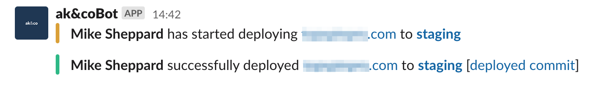

# Trellis Slack Webhook Depolyment Notifications

[](https://github.com/ItinerisLtd/trellis-slack-webhook-notify-during-deploy/tags)
[](https://github.com/ItinerisLtd/trellis-slack-webhook-notify-during-deploy/blob/master/LICENSE)

Sends an initial deployment started and a deployment successful message to a Slack channel when [Trellis](https://github.com/roots/trellis) deploys [Bedrock](https://github.com/roots/bedrock).

<!-- START doctoc generated TOC please keep comment here to allow auto update -->
<!-- DON"T EDIT THIS SECTION, INSTEAD RE-RUN doctoc TO UPDATE -->

- [Requirements](#requirements)
- [Screenshots](#screenshots)
- [Installation](#installation)
- [Role Variables](#role-variables)
- [Usage](#usage)
- [FAQs](#faqs)
  - [How do I get a Slack Webhook URL?](#how-do-i-get-a-slack-webhook-url)
- [See Also](#see-also)
- [Testing](#testing)
  - [Syntax Check](#syntax-check)
- [Author Information](#author-information)
- [Feedback](#feedback)
- [Change log](#change-log)
- [License](#license)

<!-- END doctoc generated TOC please keep comment here to allow auto update -->

## Requirements

- Trellis v1.0.0 or later
- Ansible v2.6 or later
- Valid Slack Webhook URL

## Screenshots



## Installation

Add this role to `requirements.yml` or `galaxy.yml` in newer versions of Trellis:

```yaml
# requirements.yml / galaxy.yml
- name: slack-notify
  src: https://github.com/ItinerisLtd/trellis-slack-webhook-notify-during-deploy
  version: 0.3.0 # Check for latest version!
```

Run the command:

```bash
➜ ansible-galaxy install -r requirements.yml --force
```

With newer versions of Trellis, run:

```bash
➜ ansible-galaxy install -r galaxy.yml --force
```

## Role Variables

Add the start & success tasks to the `deploy_before` & `deploy_after` deploy [hooks](https://roots.io/trellis/docs/deploys/#hooks):

```yaml
# roles/deploy/defaults/main.yml
deploy_before:
  - "{{ playbook_dir }}/vendor/roles/slack-notify/tasks/deploy_start.yml"

...

deploy_after:
  - "{{ playbook_dir }}/vendor/roles/slack-notify/tasks/deploy_success.yml"
```

Add your Slack webhook token(s) (end of the webhook URL) and channel into `group_vars/{environment}/vault.yml`

```yaml
# group_vars/{environment}/vault.yml
vault_wordpress_sites:
  example.com.au:
    slack_deploy_token:
      - XXXXXXXXX/XXXXXXXXX/XXXXXXXXXXXXXXXXXXXXXXX
      - XXXXXXXXX/XXXXXXXXX/XXXXXXXXXXXXXXXXXXXXXXX
    env:
      ...
```

## Usage

[Deploy](https://roots.io/trellis/docs/deploys/#example) as usual. No special action needed.

## FAQs

### How do I get a Slack Webhook URL?

1. Visit the ["Your Apps"](https://api.slack.com/apps) page on Slack
2. Create an App (e.g. "Deployment alerts") and enable "Incoming Webhooks"
3. Setup a Webhook for your desired Workspace
4. Copy the Webhook URL for use in [Installation](#installation)

Note: Each Webhook can only post to one channel since Slack changed their API. You will need to set up a webhook per channel you wish to notify.

## See Also

- [Incoming WebHooks for Slack](https://get.slack.help/hc/en-us/articles/115005265063-Incoming-webhooks-for-Slack)

## Testing

### Syntax Check

```bash
➜ ansible-playbook -i 'localhost,' --syntax-check tests/test.yml
```

## Author Information

[trellis-slack-webhook-notify-during-deploy](https://github.com/ItinerisLtd/trellis-slack-webhook-notify-during-deploy) is a [Itineris Limited](https://www.itineris.co.uk/) project created by [Lee Hanbury-Pickett](https://github.com/codepuncher).

Special thanks to [the Roots team](https://roots.io/about/) whose [Trellis](https://github.com/roots/trellis) make this project possible.

Full list of contributors can be found [here](https://github.com/ItinerisLtd/trellis-slack-webhook-notify-during-deploy/graphs/contributors).

## Feedback

**Please provide feedback!** We want to make this library useful in as many projects as possible.
Please submit an [issue](https://github.com/ItinerisLtd/trellis-slack-webhook-notify-during-deploy/issues/new) and point out what you do and don't like, or fork the project and make suggestions.
**No issue is too small.**

## Change log

Please see [CHANGELOG](./CHANGELOG.md) for more information on what has changed recently.

## License

[trellis-slack-webhook-notify-during-deploy](https://github.com/ItinerisLtd/trellis-slack-webhook-notify-during-deploy) is released under the [MIT License](https://opensource.org/licenses/MIT).
